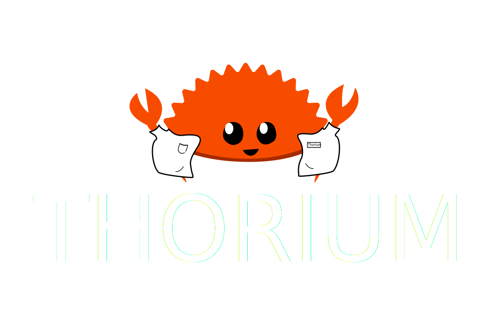
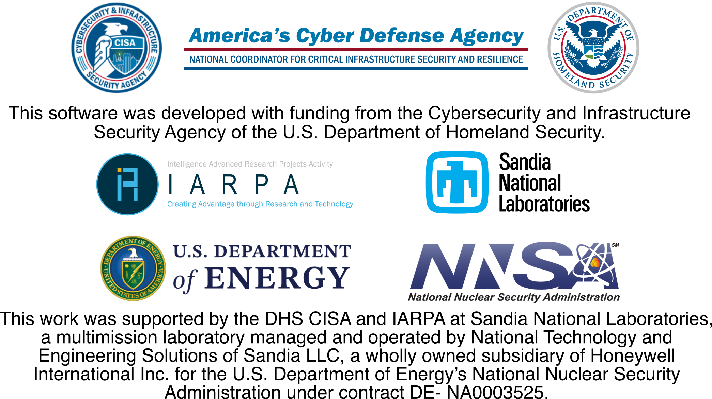

  <picture>
    <source media="(prefers-color-scheme: dark)" srcset="./api/docs/src/static_resources/logo_dark.svg">
    <source media="(prefers-color-scheme: light)" srcset="./api/docs/src/static_resources/logo_light.svg">
        
  </picture>

A scalable file analysis and data generation platform that allows users to
easily orchestrate arbitrary docker/vm/shell tools at scale.

### Features
---
- Highly scalable analysis of arbitrary files/repos
- Near zero-cost analysis tool integration
- Static and dynamic analysis sandboxes
- User friendly interfaces: GUI + CLI
- RESTful API for automated access to data
- Multi-tenant friendly permission system
- Full-text search of analysis results
- Key/Value tags for labeling data

### Funded by
---

    

Contact us at thorium@sandia.gov.
