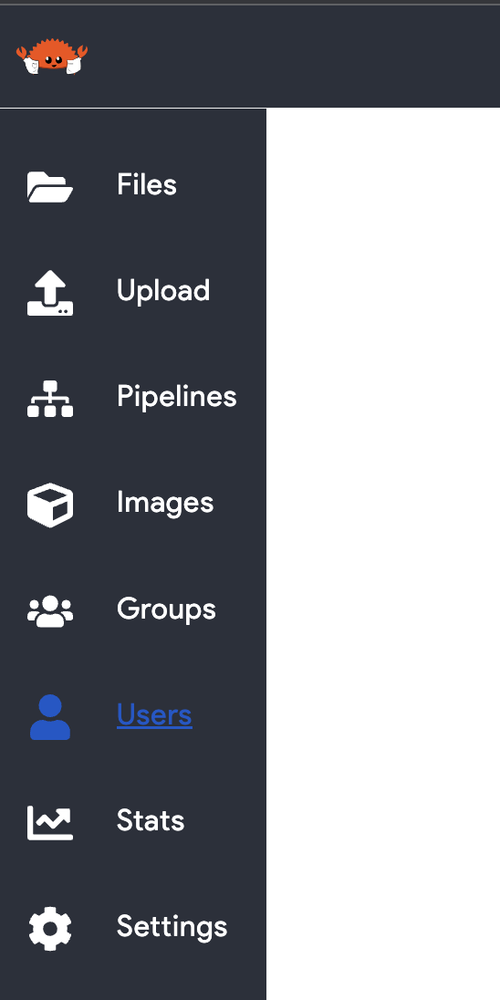
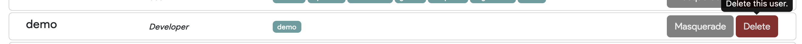
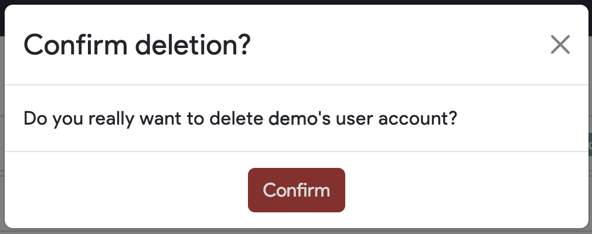

# Delete a User

Only admins can delete the Thorium accounts of users. To delete a user's account, navigate to the users page in the Web UI using the left hand navigation bar (`https://<URL>/users`).

    

Scroll to the Thorium user you want to delete. You will see a delete button to the right side of the users name, role, and group membership. Click the delete button.

    

You will see a confirmation modal appear after clicking delete. Confirm that you selected the correct user to delete.

    
