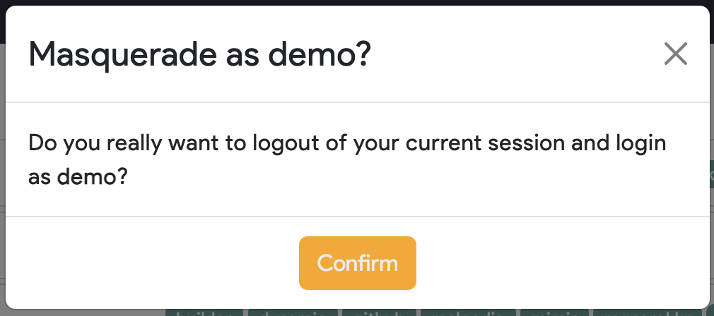

# Troubleshooting Web UI Issues

It can be difficult to troubleshoot a user's Web UI issues without having access to that user's browser session. To
help with this problem, the Thorium Web UI supports an admin-only feature allowing for masquerading as a different
user.

To masquerade as a user, navigate to the users page in the Web UI using the left hand navigation bar (`https://<URL>/users`).

    

Then scroll to the username of who reported the issue and click the masquerade button on the right side of the users name, role, and group membership.

    

A modal will pop up asking to confirm that you want to logout of your current session and into a session for that user.

    

Don't forget to logout from your masquerade session when you are done troubleshooting.