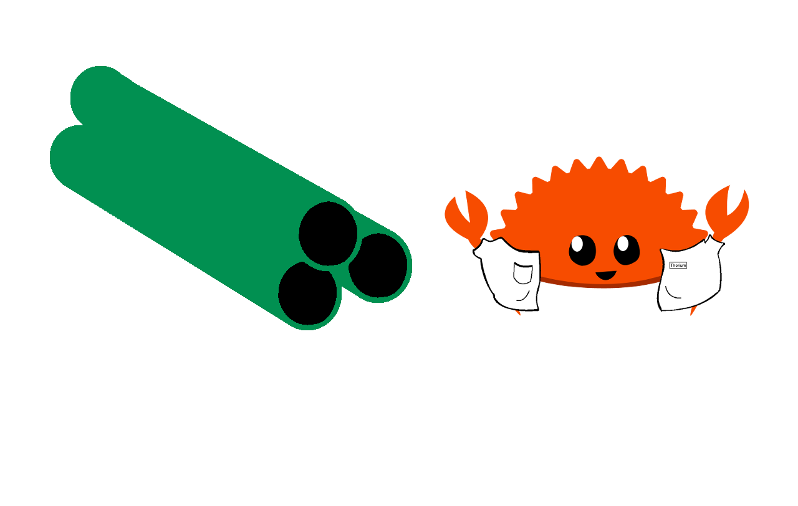

# Listing Pipelines

Pipelines can be listed at the group level. You can list all pipelines in a 
group by sending a GET request to this endpoint:
```
<api_url>/pipelines/list/:group
```

This will then return you a list of all pipelines that are in that group. The
cursor field is optional and will not exist if there are no more piplines to
return. The response should be in this format:
```json
{
  "cursor": 1,
  "names": [
    "tester"
  ]
}
```

You can also list pipelines details with a GET request to the following endpoint.
```
<api_url>/pipelines/list/:group/details
```

Like listing pipeline names the cursor field is optional and will not exist if
there are no more pipeline details to return. All order vectors are represented
as a Vec\<Vec\<String\>\> internally so they will be returned in that form. This means
that ["tester"] was turned into [["tester"]] as show below.

```json
{
  "details": [
    {
      "group": "test-thorium",
      "name": "tester",
      "order": [["tester"]],
      "sla": 86400
    }
  ]
}
```

<p align="center">
    

