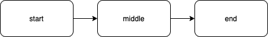
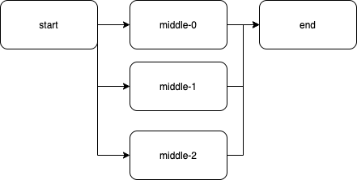
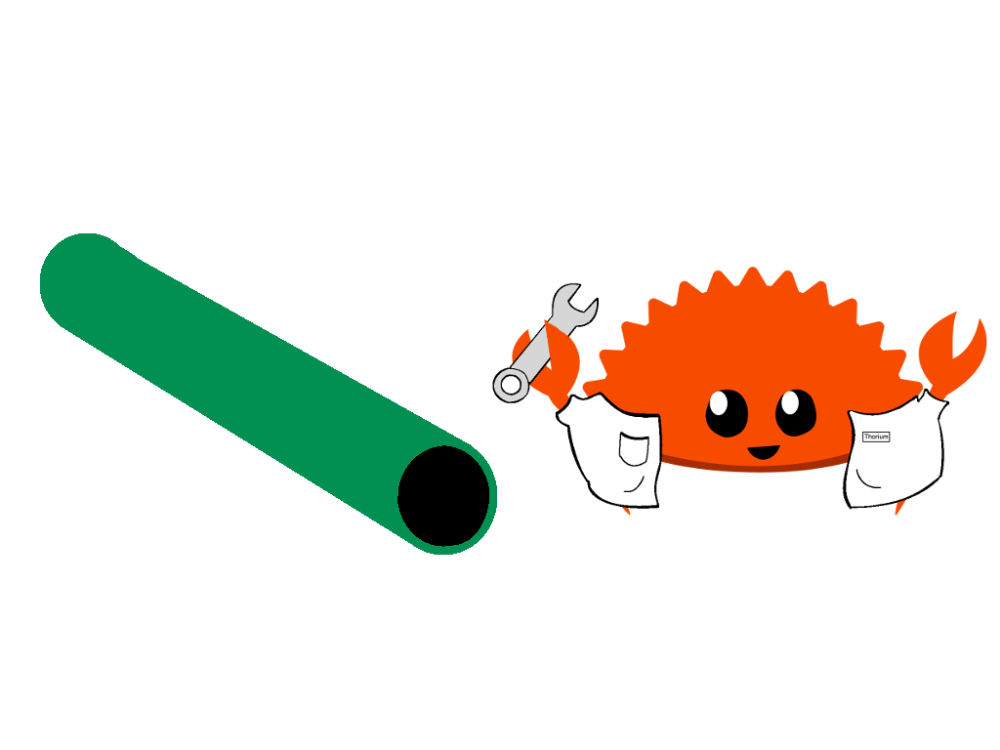

# Pipelines

Pipelines can be thought of as the map that Thorium will follow when executing your
jobs. They allow you to string images together in order to accomplish
more complex tasks.

You can create a pipeline by POSTing to the following endpoint.
```
<api_url>/pipelines/
```

In the body of that POST you will need to put the pipeline declaration object.
It should look something like this:
```json
{
  "name": "test",
  "group": "test-thorium",
  "order": ["tester"],
  "sla": 86400,
}
```

Explanations for these field are:

| key | definition |
| --- | ---------- |
| group | The group the pipeline is in |
| name | The name of the pipeline to create |
| order | The order stages/images should be executed in this pipeline |
| sla | How long you can wait for this reaction in this pipeline to complete (optional) |

### Order
---
Order can be a list of strings or it can be a list containing a list of strings.
This can be used to run images in parallel instead of sequentially. When a list
of images is encountered Thorium will attempt to run all images of that stage at once
and will not start the next stage until all of the current stage's images have
completed. It is important to understand that while Thorium will attempt to run the
images in parallel it is not guaranteed and so connectivity between images should
not be counted upon.

It is also important to note that while lists of lists of strings are valid lists
of lists of lists of strings are not.

| order | validity |
| --- | ---------- |
| ["start", "middle", "end"] | ✅ |
| ["start", ["middle-0", "middle-1", "middle-2"], "end"] | ✅ |
| ["start", ["middle-0", ["middle-1", "middle-2"]], "end"] | ❌ |

So if we were to create a pipeline with an order of a list of strings it would
something look like:

<p align="center">
    

While a pipeline with a nested list of strings within it would look something
like:

<p align="center">
    

### SLA
---
SLA's in Thorium are weakly enforced and are primarily used for determining the
priority of reactions. We use SLA for this instead of a simple 0-4 ranking system
as SLA has a much higher cardinality and also allows us to have a single metric that
captures priority and age. Where as with a simple 0-4 ranking system we would need to
rank all reactions in terms of priority then also rank them in terms of age. The
default SLA can be set in the Thorium yaml config.

<p align="center">
    
