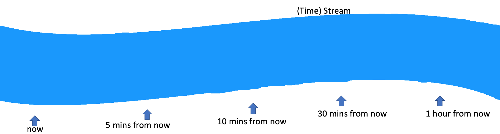
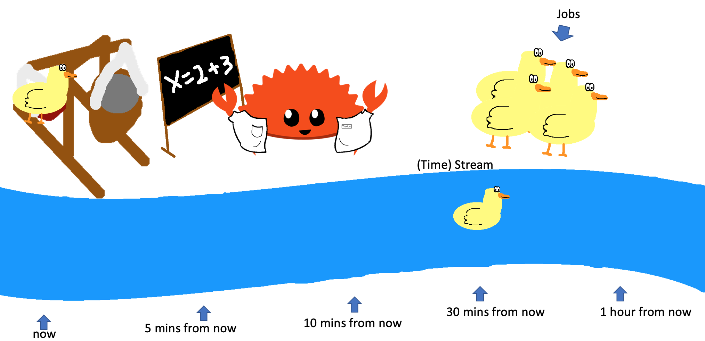

# Streams

Streams are how Thorium determines job priority and help us solve a single problem:

*Distilling a bunch of features down to a single score is hard*

The features Thorium would need to distill are:
 - priority
 - cost to run
 - SLA

The other problem is calculating a single score would require us to constantly
recalculate every jobs score in order to prevent starvation from occuring. This
could get incredibly costly compute wise and also has the problem that we need to
ensure one score does not outweigh the others in an unexpected way.

Streams allow us to efficently sidestep this problem by making the issue of 
starvation no longer possible and by making the "score" a metric based in
reality instead of being arbitrary. We can do this by creating a data structure
where items are scored based on timestamps.

    

Then when jobs are submitted Thorium determines when they must be run by in order
to meet their SLA (If no SLA is submitted then a default one is assumed based on
expected runtime). This allows Thorium to distill both cost to run (time wise)
and SLA into a single score.

    
