# Configuring Images

This section explains each configurable image field. This information is critical to getting your image to run
in Thorium. so please read each field description before attempting to add a new image. Images with incorrect
configurations may fail when run or never be run at all.

---
#### Name

(*Required*)

Your image needs a name. Names must be unique within a group and can only consist of lower case alpha-numeric
characters and dashes.

---
#### Group

(*Required*)

Assign your image to a group. An image may only be in a single group, although you can easily copy your image to
different groups using the Web UI. Images are just a configuration so there is no waste in having duplicates.

---
#### Description

(*Optional*)

A basic text description of what this tool does and what analysis artifacts it may produce. It will be displayed in
the image details, so please help users of your tool by providing a thorough description..

---
#### Scaler

(*Required*)

The Thorium scheduler that will be responsible for running this image. For containerized tools that execute static
analysis on files or repos, select `K8s`. If your tool must be run on bare metal hardware or does dynamic analysis,
please contact an admin for help with the setup of a `BareMetal` image.

| Scheduler | Description | Admin Setup Help Required |
| ---- | ---- | ---- |
| K8s | Scheduled by the Thorium Kubernetes scheduler, k8s scheduled tools are run in containers. | No |
| BareMetal | Scheduled by the Thorium BareMetal scheduler, BareMetal tools runs directly on a server outside of a container or VM. | Yes |
| External | Scheduling of external jobs is not handled by Thorium, external tools must interact with the API to get jobs and update job status. | No |

---
#### Image/Tag

(*Required for K8s scheduled images*)

For containerized tools that use the `K8s` scheduler, enter the image `url:port/path:tag` for the registry image. For
example, an image pulled from `hub.docker.com` would enter `ubuntu:latest` since its a default registry. A different
registry would use the registries URL and port to tell Thorium where to go to grab the container image.

`registry.domain:5000/registry/path:v1.0`

If the registry you specify requires authentication, you will need to provide a registry token for Thorium to pull
your image before it will run. Please reach out to your local Thorium admins to provide that registry token.

---
#### Version

(*Optional*)

The version of the underlying tool that is executed when this image is run. Ideally the version you provide should
formatted using semantic versioning, however this is not a requirement.

---
#### Timeout

(*Required*)

The maximum time an image will be allowed to run in seconds. A running image will be killed after this time limit has
been reached.

---
#### Display Type

(*Required*)

If this tool produces any results, this configures what format are those results take. This setting is used by the
Web UI to display any renderable tool results on the file/repo details page. For images that do not return results,
select any value.

| Type | Description |
| --- | ---------- |
| Json | For a `results` file that is valid JSON, an interactive JSON renderer will be displayed.  Url links to `children` files and downloadable `result_files` links will be displayed. |
| String | Plain text `results` get rendered along with links to `children` files and downloadable `result_files` links. |
| Image | Render any `result_files` images as well as any text output from the `results` file. Links to `children` files and downloadable `result_files` links are also displayed. `Result_files` must contain a valid image extension to be rendered in the Web UI. |
| Table | Display tool `results` as a two column table. Links to `children` files and downloadable `result_files` links are also displayed. |
| Disassembly | Display tool `results` as disassembled code from binary. The renderer will apply syntax highlighting if it recognizes the language of the file.  |
| Hidden | Do not render `results` produced by this tool. Results will be hidden from users in the Web UI.  |
| Custom | Custom renderers can be built for specific tools and added by Thorium's Web UI developers. |
---
#### Spawn Limit

(*Optional, defaults to Unlimited*)

The max number of running images of this type that the Thorium scaler will attempt to spawn.

---
#### Collect Logs

(*Optional, defaults true*)

Boolean value on whether Thorium will collect stdout and stderr as logs from this image. Reaction logs can be viewed
during and after a reaction runs and are useful for troubleshooting broken tools.

---
#### Generator

(*Optional, defaults false*)

Boolean value on whether this image will require Thorium to respawn it after it sleeps. This is useful for building
long running tools that must checkpoint/sleep and then subsequently be respawned. This is an advanced feature that most
tools/developers will ignore.

---
#### Resources

(*Optional, defaults are set for CPU/Memory only*)

The resources section tells Thorium what compute, memory, and storage resources your tool needs to successfully run.
Values for CPUs, memory, ephemeral storage, and GPUs may all be set.

<p align="center">
    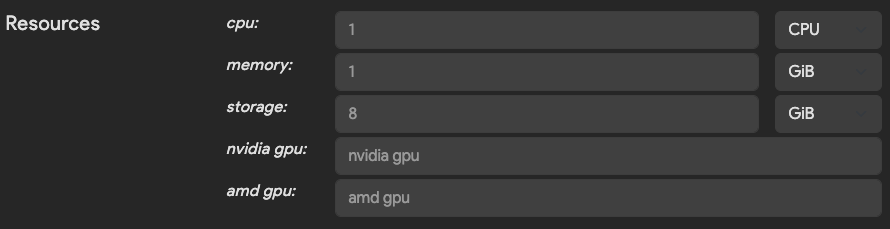
</p>

You should set these values to the largest expected value your tool will need to run. If your tool's peak memory usage
is 16GB, select at least that amount for the image's memory resource configuration. If you set a value that is too low
for memory or CPU usage, your tool may run slowly and/or be killed for using more resources than this configuration
allows. On the other hand, selecting values that are too high for any resource may limit or prevent Thorium from
scheduling your tool to run. Thorium can only schedule an image to run on systems where there are resources available
to meet the requested resource values for that image.

---
#### Arguments

(*Optional*)

Arguments define how Thorium will trigger the execution of your tool. Command line arguments for a tool are built based
on this configuration.

<p align="center">
    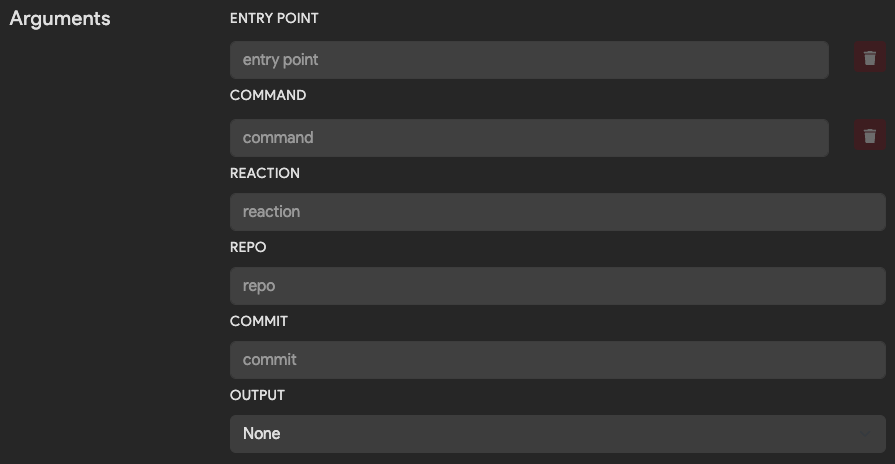
</p>

The following table explains what each optional argument does and when to specify it.

| Argument | Description | Example|
| --- | ---------- | ---------- |
| Entrypoint | The initial executable to run. | `/path/to/python3` |
| Command | List of parameters to pass to the Entrypoint executable, one value per form field. | `/path/to/script.py`, `--flag`, `some_value` |
| Reaction | Flag to pass in UUID of the running Thorium reaction. Only specify if the tool needs a unique identifier. | `--reaction` |
| Repo | Flag to pass in repo name if a repo is being analyzed. | `--repo` |
| Commit | Flag to pass in commit hash if a repo is being analyzed. | `--commit` |
| Output | How to tell the tool where to place tool results/outputs. | `Append` to place the output path at the end of the command line args or use `Kwargs` and specify a flag to pass in the path such as `--output` |

---
#### Output Collection

(*Optional*)

After a tool has run, the Thorium agent will collect tool results, children files, and metadata tags. The Thorium
agent, will then upload these artifacts to the API so they are accessible within the Web UI or using Thorctl. The
output collection settings tell the agent how to handle these artifacts.

<p align="center">
    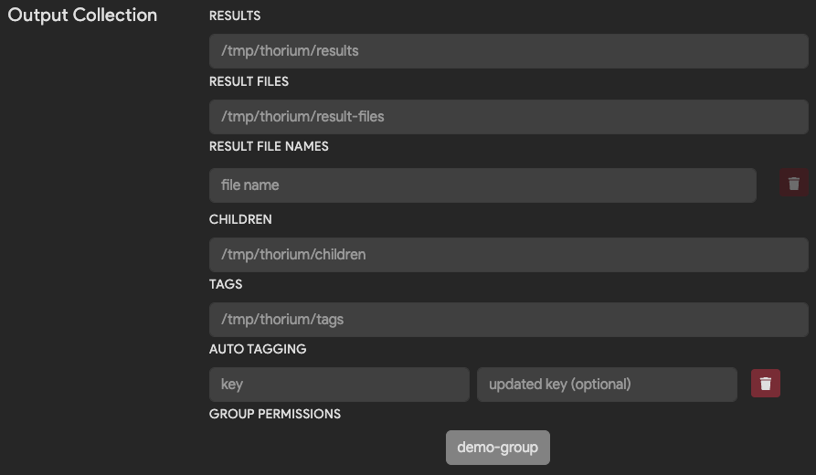
</p>

The following table explains how to configure the agent to handle your tools outputs.

| Field | Description | Default |
| --- | ---------- | ---------- |
| Results | Path to a renderable result file. The contents of the file will be displayed in the Web UI based on the `display_type` setting. | `/tmp/thorium/results` |
| Result Files Path | Path to a directory of result files to upload. Result files will be displayed as downloadable links in the Web UI. | `/tmp/thorium/result-files` |
| Result File Names | Names of specific result files to upload. If specified all other files will be ignored. | `None` |
| Children | Path to a directory of children files produced by running the tool. Within this directory, children must be placed into a subdirectory with the type of child as its name: `unpacked` or `source`. Children files are automatically CaRTed upon upload to Thorium. | `/tmp/thorium/children` |
| Tags | Path to a JSON dictionary of key/value pairs to upload as tags. This file must be valid JSON.| `/tmp/thorium/tags` |
| Group Permissions | Groups to which results and tags are uploaded. By default tool results are upload to all your groups that have access to the target file/repo. Use this when you are working with potentially sensitive tools. | `None` |

When a tool's analysis result is a valid JSON dictionary, the agent can automatically pull key/value tags and upload
them to the file or repo that the tool ran against. The following table explains how to configure `Auto Tagging`.

| Field | Description |
| --- | ---------- |
| Key | The matched key in the tools JSON result dictionary. The key must be at the root level of the dictionary. |
| New Key/Updated Key | The renamed string that will get uploaded as the new tag's key. |

<br/>

---
#### Child Filters

(*Optional*)

Child filters allow users to specify regular expressions to match on children files before submitting them.
This is especially helpful working with a tool that outputs many files to its configured children directories
with no easy way to filter them in the tool itself.

By default, children that match at least one filter will be submitted. If `Submit Non-Matches` is set, only
children that don't match *any* of the given filters will be submitted. If no child filters are provided,
all children will always be submitted.

All filters must be valid [regular expressions](https://en.wikipedia.org/wiki/Regular_expression) parseable by the
Rust [regex crate](https://docs.rs/regex/latest/regex/). If an invalid regular expression is provided, Thorium
will return an error.

##### MIME Filters

MIME filters match on the MIME type of a file according to its magic number. Supported MIME types can be found
[here](https://github.com/bojand/infer/blob/66c1890f7f44f24d3dfa6c4eb966b84942ab9ece/README.md#supported-types).
For example, if you want to match only image MIME types, you can provide the filter `image.*`.

##### File Name Filters

File name filters match on children's file names, including their extension. For example, if you want to submit
only children starting with `lib`, you can provide the filter `lib.*`.

##### File Extension Filters

File extension filters match on children's file extensions without the leading `.` (`exe`, `txt`, `so`, etc.).
For example, if you want to submit only exe files, you can provide the filter `exe`.

<br/>

---
#### Dependencies

(*Optional*)

Any samples, repos, tool results, or ephemeral files that your tool needs to run will be configured here. These
configuration options help Thorium tell your tool where to find the tool's dependencies that are automatically
downloaded by the Agent before your tool is executed.

##### Samples

The `Samples` settings are relevant for tools used to analyze Thorium files. Since all files in Thorium are stored
in a CaRTed format, the agent handles the download and unCaRTing of those files before executing your tool. You may
use the sample dependency settings to change the default download path and how Thorium tells your tool where to find
the downloaded file(s).

<p align="center">
    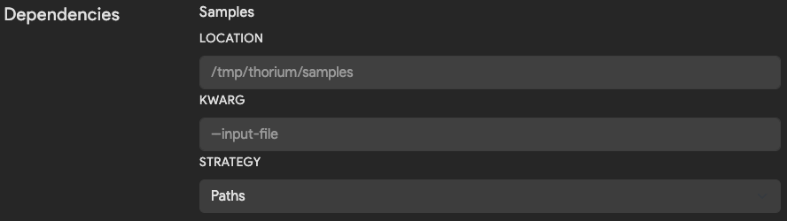
</p>

| Field | Description | Default |
| --- | ---------- | ---------- |
| Location | Directory path to download files into. Downloaded files are named based on their sha256 hash. | `/tmp/thorium/samples` |
| Kwarg | Flag used to pass in name or path to file. If blank, positional args are used to pass in value. | `None` |
| Strategy | Whether to pass in path or name to the kwarg. Options are `Path`, `Names` or `Disabled` when no argument should be passed. | `Path` |

##### Repos

If a tool takes a Git repository as an input, this section can be configured to change the default location the Agent
will download that repo into. Since all repos in Thorium are CaRTed upon upload, the agent will download and
automatically unCaRT downloaded repos.

<p align="center">
    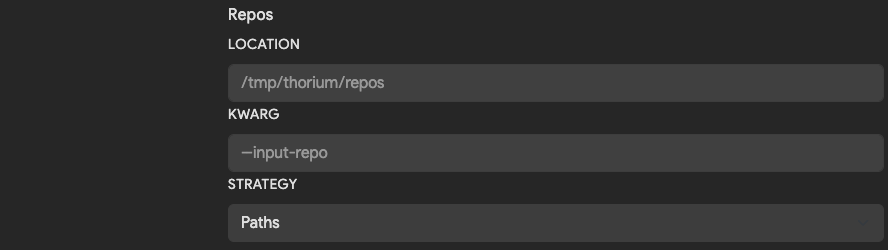
</p>

| Field | Description | Default |
| --- | ---------- | ---------- |
| Location | Directory path to download repos into. | `/tmp/thorium/repos` |
| Kwarg | Flag used to pass in name or path to a repo. If blank, positional args are used to pass in value. | `None` |
| Strategy | Whether to pass in path or name to the kwarg. Options are `Path`, `Names` or `Disabled` when no argument should be passed. | `Path` |

##### Ephemeral and Results

Sometimes tools may take the outputs from another tool as their input. These tools will be configured to run in a
multistage pipeline after being added. The below fields tell Thorium what inputs a tool requires and
where to download those inputs into before running the tool runs.

*What are ephemeral files?*

Ephemeral files are discarded at the end of a pipeline run. You might call these files intermediate artifacts of
the pipeline. They can be passed between the images that run within a pipeline using the following configurations.

<p align="center">
    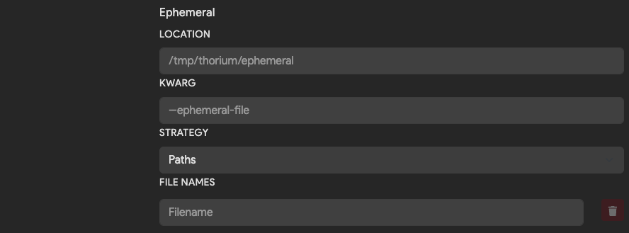
</p>

| Field | Description | Default |
| --- | ---------- | ---------- |
| Location | Directory path to download ephemeral files into. | `/tmp/thorium/ephemeral` |
| Kwarg | Flag used to pass in name or path of each ephemeral file. If blank, positional args are used to pass in value. | `None` |
| Strategy | Whether to pass in path or name to the kwarg. Options are `Path`, `Names` or `Disabled` when no argument should be passed. | `Path` |

*What are results?*

Results are files that will be saved in Thorium after a tool runs. Unlike ephemeral files, the lifetime of a result is
longer than the pipeline that generated it. You can view and download results in the Web UI or Thorctl any time after a
tool runs.

<p align="center">
    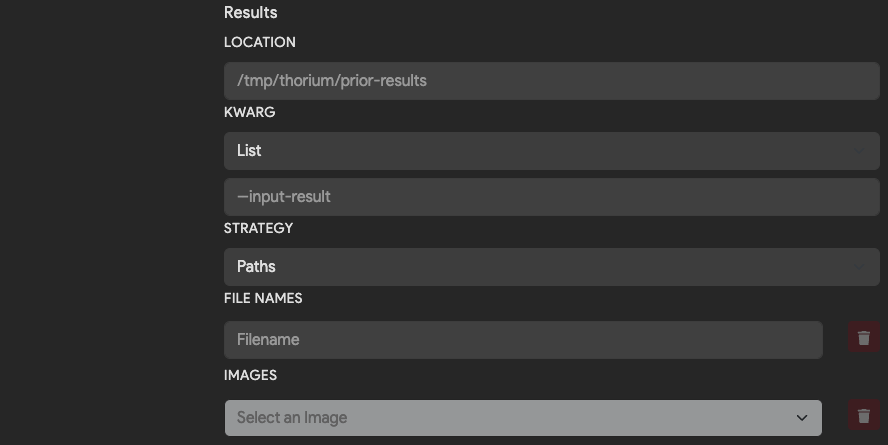
</p>

| Field | Description | Default |
| --- | ---------- | ---------- |
| Location | Directory path to download input results into. | `/tmp/thorium/prior-results` |
| Kwarg | Flag used to pass in name or path of each input result file. | `None` |
| Strategy | Whether to pass in path or name to the kwarg. Options are `Path`, `Names` or `Disabled` when no argument should be passed. | `Path` |
| File Names | Names of result files to download from the dependent tool results. | `Empty`  |
| Images | Names of other tools that this image need results from to run. | `Empty` |

*What are tag dependencies?*

"Tags" in the context of dependencies refer to the Thorium tags of the sample or repo dependencies for a given reaction
(described above in [Samples](#samples) and [Repos](#repos)). This is useful when you have an image that can make decisions
based on tags set by other images in Thorium (or even by previous runs of the same image). For example, if you have an image
that is more effective at analyzing a sample if it knows the original language it was compiled from, you could add another image
earlier in the pipeline that attempts to tag the image with its language of origin (e.g. `Language=Rust`). Then, after enabling
tag dependencies for the analysis image, you can refer to the sample's tags in your image to see which language was inferred
and analyze accordingly.

<p align="center">
    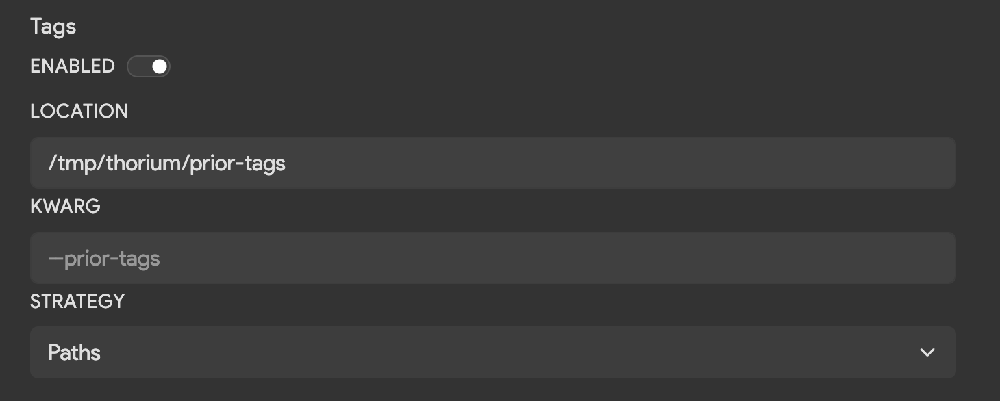
</p>

| Field | Description | Default |
| --- | ---------- | ---------- |
| Location | Directory path to download sample/repo tags into. | `/tmp/thorium/prior-tags` |
| Kwarg | Flag used to pass in the name or path of each tags file. | `None` |
| Strategy | Whether to pass in the path or name to the kwarg. Options are `Path`, `Names`, `Directory`, or `Disabled` when no argument should be passed. | `Path` |

Tag files are by default saved to the directory `/tmp/thorium/prior-tags` and saved in the JSON format named as `<SHA256>.json`
for samples or organized into subdirectories by URL for repos (e.g. `/github.com/project/repo.json`). The following is an example of a
tag file:

```json
{
    "Language": [
        "Rust",
    ],
    "Strings": [
        "Hello, world!",
        "Goodbye",
        "I'm a string 😎"
    ]
}
```

<br/>

---
#### Environment Variables

(*Optional*)

Environment variables are dynamically set values that can affect the execution of a tool. Both Linux and Windows
environments can have environment variables. Thorium will set any configured key/value environment variable pairs
in the correct execution environment before an image runs. If your tool reads variables from the environment, it
will be able to grab the key/value pair. A unique key is required when adding an environment variable. However,
the value of that key can be empty/blank.

<p align="center">
    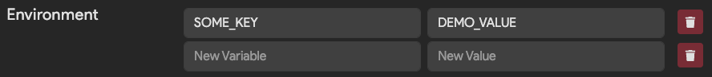
</p>

You can view the value of an environment variable on a Linux system using the following command:

```bash
echo $VARIABLE_NAME
VARIABLE_VALUE
```

This command may be useful when troubleshooting to confirm the environment variable is being set to the correct
value when your tool runs.

---
#### Volumes

(*Optional, K8s images only*)

Volumes are an advanced feature and are only relevant for tools that run in Kubernetes. Volumes in K8s can take the
form of configuration files, secret files, host paths, or NFS shares. You can read more about K8s volumes in the
[K8s docs](https://kubernetes.io/docs/concepts/storage/volumes/).
If you think you need to map a volume into your K8s image you will need to reach out to an admin to have that volume
setup within Thorium's K8s instance.

<p align="center">
    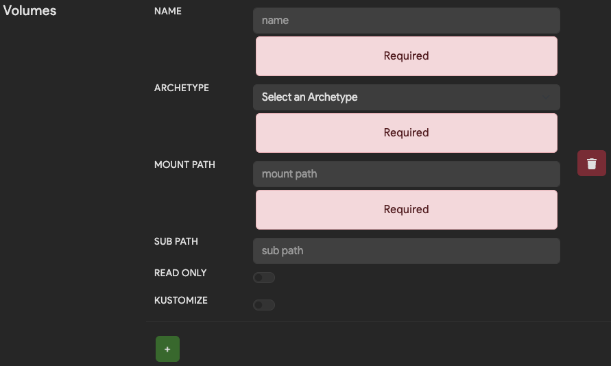
</p>

---
#### Security Context

(*Optional, only admins can set these values*)

By default Thorium runs all images as the user that requested them to run. This means that running tools have the
effective user and group ID of a user rather than the developer that created the tool or some other privileged
account. This helps to bound the abilities of tools that run in Thorium's different execution environments. The
security context values can be changed by admins to hard coded values that differ from these defaults. Note that
the privilege escalation boolean setting is only relevant for images that run in K8s.

<p align="center">
    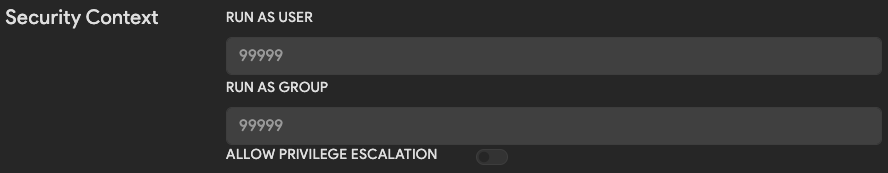
</p>
