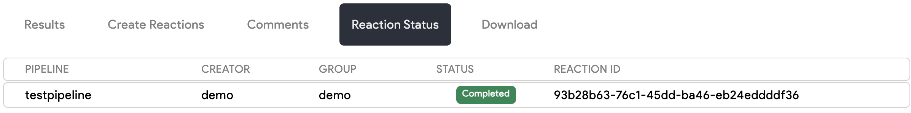

# Reaction Status

Reactions are instances of a running pipeline. As described in the
[Building Pipelines](./build_pipelines.md#what-are-pipelines) chapter, pipelines consist of multiple sequentially
executed stages where each stage can run multiple images in parallel. Each reaction you run has its own status and
you can view those statuses in the Web UI.

The following table explains each possible reaction status:

| Status | Meaning |
| ---- | ---- |
| Created | The reaction has been created, but is not yet running. |
| Running | Atleast one stage of the reaction has started. |
| Completed | This reaction has completed successfully. |
| Failed | The reaction has failed due to an error. |

On the file details page, you will see a list of reactions that have been run on the file.

<p align="center">
    
</p>

If you hover over and then click a specific reaction, you will be redirected to the reaction status
page. This page shows the status of pipeline jobs, the overall reaction status, and reaction logs. You
are also provided a link to the reaction status page when you initial submit a reaction via the Web UI:

<video autoplay loop controls>
  <source src="../static_resources/reactions/submit-reaction.mp4", type="video/mp4">
</video>

If you are using Thorctl to generate your analysis reactions, you can also watch the status of reactions
you create on the command line using `--watch` or `-w`.

```bash
$ thorctl reactions create --group demo --pipeline testpipeline -f
CODE | PIPELINE                  | SAMPLES                                                          | ID                                   | MESSAGE                         
-----+---------------------------+------------------------------------------------------------------+--------------------------------------+----------------------------------
200  | testpipeline              | 85622c435c5d605bc0a226fa05f94db7e030403bbad56e6b6933c6b0eda06ab5 | a0498ac4-42db-4fe0-884a-e28876ec3496 | -                               
-----+---------------------------+------------------------------------------------------------------+--------------------------------------+----------------------------------

	WATCHING REACTIONS	

STATUS       | PIPELINE                  | ID                                  
-------------+---------------------------+--------------------------------------
...
```
