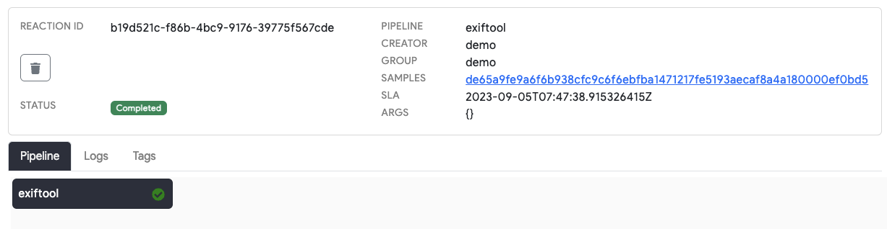
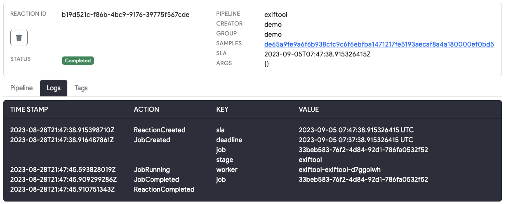
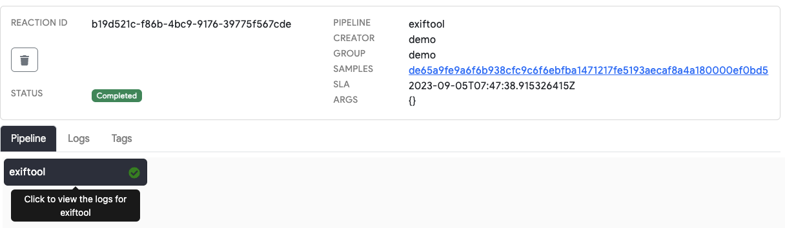
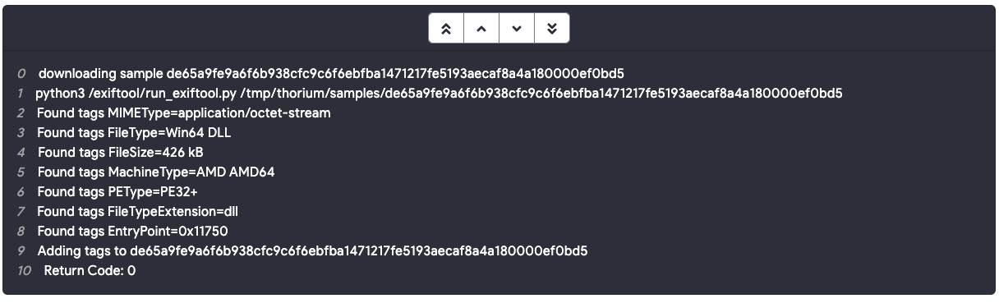

# Viewing Reaction Status and Logs (Web UI)

You can use the reaction status page to view the state of any reaction, the reaction's logs, and info about the different stages of the reaction. Links to reactions are provided when submitting new pipelines via the Web UI upload or file details pages.

    

The logs tab will show a summary of the overall reaction, including info about when each stage starts and is completed.

    

# Viewing Reaction Stage Logs (Web UI)

If you want to view the logs of a tool that runs within an individual reaction stage, hover over the image name and click. This will open the stage logs for that stage:

    

You will see the combined log output of the running tool and the Thorium agent that executes the tool. The agent is responsible for downloading any repos/files needed to run the reaction and then cleaning up after the tool has completed. During this cleanup process any children files and tags will be uploaded to Thorium. In between this setup and cleanup phases, you will see any stderr/stdout that is produced when the tool runs. These logs are also useful for validating the command lines that were passed to the tool when it is run.

    

The following video shows the full reaction submission and status monitoring process:

<video autoplay loop controls>
  <source src="../static_resources/reactions/submit-reaction.mp4", type="video/mp4">
</video>