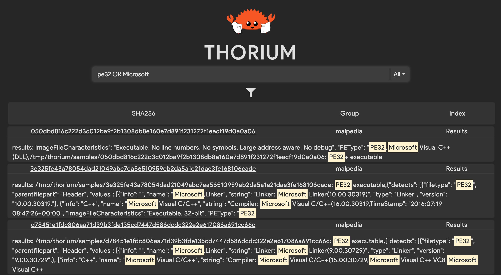
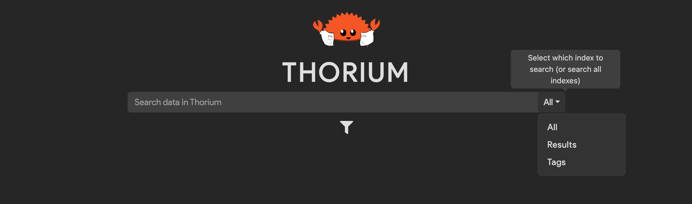
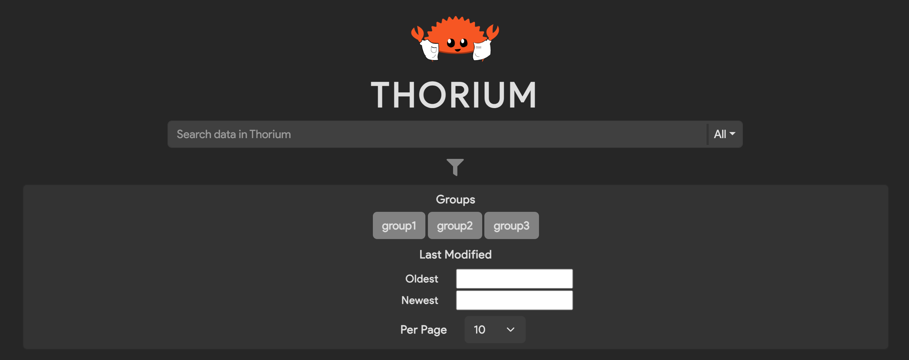

# Search

Thorium also allows users to search through tool results and file tags to find
interesting files. This is currently only available in the Web UI and can be accessed on
the home page. Thorium uses the [Lucene syntax](https://www.elastic.co/guide/en/kibana/current/lucene-query.html)
for search queries.

It's important to note that documents are indexed **per group**. This means that
for a document to be returned, **all** search parametes must be met by at least
one group (see the below [FAQ](#what-do-groups-have-to-do-with-searching-in-thorium)
for more details).

<p align="center">
    
</p>

### Indexes

Data is stored in Elasticsearch in various indexes based on the data type (i.e. results are
stored separately from tags). You can select the index to search on by selecting the dropdown
on the right of the search bar. Searches are performed on all indexes by default.

<p align="center">
    
</p>

### Search Parameters

You can specify various parameters for your search by clicking the funnel icon below the search bar.
Parameters include the sample's group(s), the date the sample was last modified, and the number of search
results to display per page. By default, no groups are selected and searches are performed on all
of the user's groups.

<p align="center">
    
</p>

### Examples

The following are examples of possibl search queries using Lucene syntax.

---

Querying for tags/results containing the text `pe32`:

```
pe32
```

Querying for tags/results containing `pe32` or `Microsoft`:

```
pe32 OR Microsoft
```

Querying for tags/results containing `rust` and `x86_64`:

```
rust AND x86_64
```

Querying for tags/results containing the string `rust and x86_64`. Use quotes to
wrap search queries that contain white space or conditional keywords:

```
"rust and x86_64"
```

Querying for tags/results containing the string `rust and x86_64` and `pe32`:

```
"rust and x86_64" AND pe32
```

Querying for tags/results containing `pe32` or string `rust and x86_64` and `pe32`:

```
pe32 OR ("rust and x86_64" AND pe32)
```

All UTF-8 text is supported:

```
✨Some 🤪 UTF-8 😁 text!!!✨
```


#### Results

Querying for results where a field named `PEType` is set to `"PE32+"`

```
"PEType:\"PE32+\""
```

#### Tags

> Note: Tags are stored in Elasticsearch with `=` delimiting the key and value.
> That means that the most effective way for searching for whole tags is by
> using `=`. Using other delimiters (e.g. `:`) may cause otherwise
> matching tags to not appear.

Querying for the tag `arch=x86_64`:

```
arch=x86_64
```

Querying for tags *exactly* matching `arch=x86_64` (use quotes):

```
"arch=x86_64"
```

Querying for files with either the tag `arch=x86_64` or `arch=arm64`:

```
arch=x86_64 OR arch=x86_64
```

Querying for files with both tags `Lang=Rust` and `arch=x86_64`:

```
Lang=Rust AND arch=x86_64
```

If tags contain Lucene keywords (e.g. `AND`, `OR`, etc.), use quotes:

```
"Tag With Spaces=Keywords AND OR" AND "Tag=Value"
```


### FAQ

##### Why does it take some time for data to become searchable?

It can take some time (usually < 10 seconds) for results to be searchable in
Thorium because they are indexed asynchronusly by a separate component called
the Thorium `search-streamer`. The time it takes for the `search-streamer`
to index data depends on how much data has been added/modified/deleted in
Thorium recently.

##### What do groups have to do with searching in Thorium?

Due to Thorium's permissioning requirements and how Elastic operates, a file will
have a separate document in Elastic for each group containing results/tags visible
in that group. That means that for a file to appear in the search results, **all** of
the given search parameters must for at least one group.


For example, let's say we have one sample with a placeholder SHA256 of `my-sha256`. This
sample is in two groups, `GroupA` and `GroupB`. The file has tags in both groups, but
not all of them are shared between groups. Our data would look something like this:

```JSON
[
    {
        "sha256": "my-sha256",
        "group": "GroupA",
        "tags": [
            "Corn": "IsGood",
            "HasTaste": "true",
            "Fliffy": "IsAGoodDog"
        ]
    },
    {
        "sha256": "my-sha256",
        "group": "GroupB",
        "tags": [
            "Corn": "IsBad",
            "HasTaste": "false",
            "Fliffy": "IsAGoodDog"
        ]
    }
]
```

So the following query would return the sample from both groups because both of the groups
have the given tag:

```
Query: "Fliffy=IsAGoodDog"

Results:

"my-sha256", "GroupA"
"my-sha256", "GroupB"
````

But this query would return no samples because *neither* of the groups have *both* of the
given tags:

```
Query: "Corn=IsBad AND HasTast=true"

Results:

```
