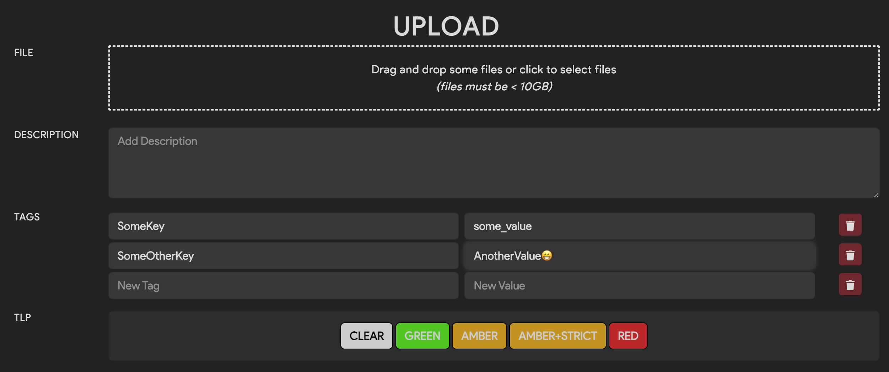

# Tagging Files

Tags are metadata key/value pairs that are used to label the files and repositories that Thorium ingests.
These labels make it easier for users and tools to find data that is stored in Thorium. It also helps users
understand the data at a glance. Fields like file type, compiler, and origin info can all be tagged to better
document the provenance  of your data. Tags can be added when a file or repo is initially uploaded, ingested
by the agent when a tool is run on that file, or added later by a Thorium user manually through the Web UI.

Tag values may contain any UTF-8 characters including symbols (e.g. Language=C++), characters from other languages
(e.g. CountryOfOrigin=Україна), or even emojis (e.g. Status=✅).

Tags are currently case sensitive, but tag normalization (standardizing capitalization of existing tags in a Thorium
instance) is a planned to be added in future versions of Thorium.

## Tagging on Upload (Web UI)
---

You can specify tags when the file is uploaded via the Web UI. Once you have selected files to upload,
enter in some key/value pairs in the tags section. Both a key and value are required to upload a given tag.
Values for a tag cannot be blank/empty strings.

<p align="center">
    
</p>


## Tagging on Upload (Thorctl)
---

When using Thorctl to upload one or more file(s), you can apply key/value tag pairs with the `-t key=value` or
`--tags key=value` flag.

```bash
$ thorctl files upload --file-groups demo --tags TagKey=sometagvalue /path/to/upload
```

If you want to specify multiple tags to apply to each file you upload, supply the `-t` or `--tags` flag multiple
times:

```bash
$ thorctl files upload --file-groups demo --tags Key1=value1 --tags Key2=value2 /path/to/upload
```


## Editing Tags (Web UI)
---

Tags can be added or removed after a sample has been uploaded via the Web UI. 

Using the Web UI, navigate to the file details page and click the edit button right under the tags icon. Once you
have clicked edit, you can add new tags or remove existing tags. When you are satisfied with your changes press the
green save tag changes button and confirm you wish to commit those changes.

<video autoplay loop controls>
  <source src="../static_resources/edit-tags.mp4", type="video/mp4">
</video>


## Editing Tags (Thorctl)
---

When using Thorctl to tag an existing file, use the `tags` command.

```bash
$ thorctl tags add --add-tags platform=MacOS --files 619dddbd681b593d8c6f66de50dd41e422bfac7a83feab6c3f0944de7c73a4d3
```

To add multiple tags at once, repeat the `--add-tags` option.

```bash
$ thorctl tags add --add-tags platform=MacOS --add-tags OS_Version=13.7.4 --files 619dddbd681b593d8c6f66de50dd41e422bfac7a83feab6c3f0944de7c73a4d3
```

To delete a tag, you must specify the complete `name=value` tag to remove.

```bash
$ thorctl tags delete --delete-tags "stripped=false"  --files 619dddbd681b593d8c6f66de50dd41e422bfac7a83feab6c3f0944de7c73a4d3
```

Be aware that `thorctl` will report success for deleting a non-existent tag.

