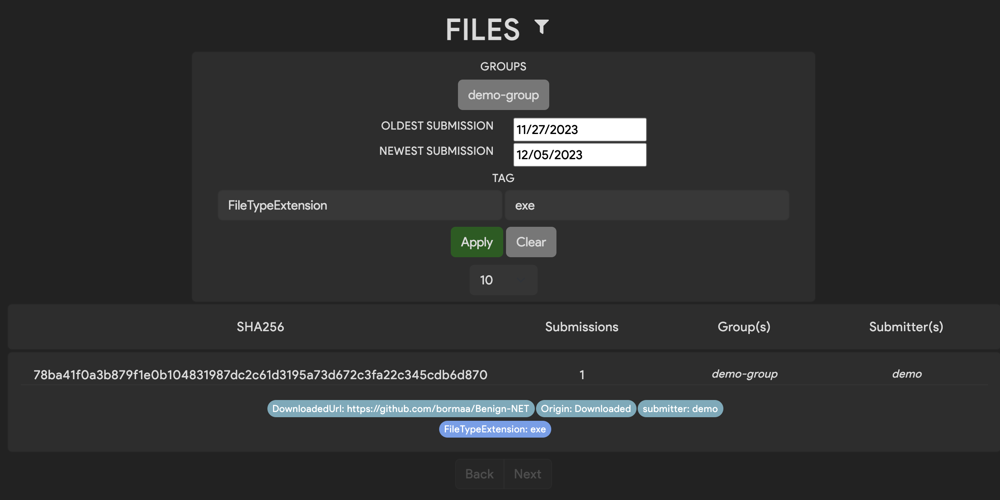

# Viewing Files

Once you have uploaded files to Thorium, you will likely want to view them and any tool results. This can be done in
either the Web UI or by using Thorctl.

## Web UI
---

You can find files by either going to the file browsing page as shown the video below or by searching using Thorium's
full text search which will be discussed more later. To view a files details simple click on it.

<video autoplay loop controls>
  <source src="../static_resources/files/file-view-details.mp4", type="video/mp4">
</video>

If you want to filter the files that are listed you can do that by changing the filter settings. Currently Thorium
supports groups, submission date ranges, and a single key/value tag as filters. Tag key/values are case sensitive.
Multi-tag filtering of files and tag normalization are both planned features that will improve file browsing.

<p align="center">
    
</p> 

You may notice that your files do not currently have many tags or results that can be used for filters. This is likely
because we haven't run many tools on these files. Running analysis tools on files will be covered in the
[spawning reactions](spawning_reactions.md) section.

## Thorctl
---
 You can also view a list of files in Thorium using Thorctl. To do that that run the following command:

```bash
thorctl files get
```

The default maximum limit of files to be displayed is 50. You can change the limit by specifying the `-l/--limit` flag:

```bash
thorctl files get --limit 100
```

#### Filter by Group
Get a list of files belonging to a certain group or groups by adding the `-g/--groups` flag. Specify multiple groups by
separating each group with a comma:

```bash
thorctl files get --groups examples,shared
```

#### Filter by Tag
Get a list of files having certain tags by adding the `-t/--tags` flag. Unlike groups, tags must be specified each with
a separate flag, as the tags themselves may contain commas or other delimiting symbols:

```bash
thorctl files get --tags Dataset=Examples --tags Corn=good
```

#### Describe a File
Display all details of particular file in a JSON-like format by using the following command, supplying the file's
SHA256 hash in place of the `<SHA256>` placeholder:

```bash
thorctl files describe <SHA256>
```
